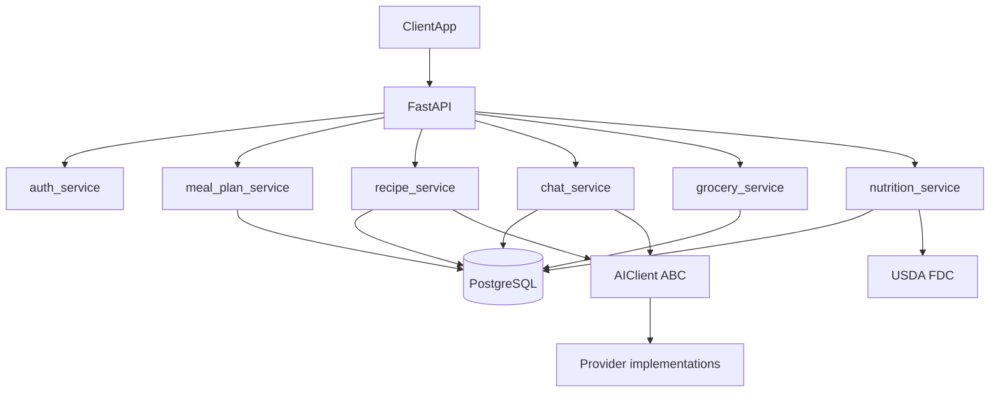

# FastAPI Meal Planner Backend (pluggable AI + Postgres)

## 1. High-level architecture

- **Goal**: A backend API that lets a client (Angular/web/mobile) manage a weekly meal plan (7 meals), call an **AI provider** to generate recipes, support per-meal chat refinement, and then produce a grocery list and approximate nutrition for each recipe.
- **Core pieces**:
  - `FastAPI` app exposing JSON endpoints.
  - `PostgreSQL` as the main database.
  - `SQLAlchemy` + `Alembic` for ORM and migrations.
  - An **abstract AI client interface** (Python ABC) with concrete implementations for each supported provider, plus a **test/local double** that does not perform network calls.
  - Service layer modules for meal planning, recipe generation, grocery list building, and nutrition estimation (they depend on the ABC, not a specific vendor SDK).

## 2. Project & module structure

- **Top-level layout** (example):
  - `app/main.py` – FastAPI app, routers include, startup/shutdown.
  - `app/config.py` – settings (DB URL, **AI provider id**, credentials and model name per provider as needed, `USDA_API_KEY`).
  - `app/db/session.py` – SQLAlchemy engine, sessionmaker, dependency.
  - `app/db/base.py` – Base class and model imports.
  - `app/models/` – SQLAlchemy models (`user.py`, `meal_plan.py`, `recipe.py`, `ingredient.py`, `chat.py`, `nutrition.py`).
  - `app/schemas/` – Pydantic models for requests/responses.
  - `app/routers/` – FastAPI routers (`meals.py`, `recipes.py`, `chat.py`, `grocery.py`, `auth.py`).
  - `app/services/` – business logic (`meal_plan_service.py`, `recipe_service.py`, `grocery_service.py`, `nutrition_service.py`, `usda_client.py`).
  - `app/clients/` – AI integration:
    - `base.py` – **ABC** defining the contract (e.g. `generate_recipes`, `chat_modify`) and shared types.
    - One module per provider (e.g. `anthropic_client.py`, future `openai_client.py`, etc.).
    - `fake.py` – **noop/recording implementation** for local runs: captures prompt text and parameters so you can review prompt parameterization without contacting a real model; returns deterministic payloads for tests.
  - `app/utils/` – shared helpers (e.g., prompt templates, parsing utilities).
  - `alembic/` – migration environment and versions.

- **Wiring**: App startup selects the concrete client from `settings` (e.g. `AI_PROVIDER=anthropic` vs `AI_PROVIDER=test`) and injects it into services; tests swap in the test double by default.

## 3. Data model design (Postgres via SQLAlchemy)

- **Users** (`User`)
  - Fields: `id`, `email`, `password_hash`, `google_sub` (nullable), timestamps.
  - Email/password plus optional Google OIDC (`GET /auth/google`, `GET /auth/google/callback`) when `GOOGLE_*` settings are set.
  - Related: `UserPreferences` (1:1) — stores `unit_system` (metric|imperial, default metric). The backend always stores and returns quantities in metric; `unit_system` is a frontend display hint only.
  - Related: `RevokedToken` — JTI denylist for logout; rows expire naturally at token TTL.

- **Meal planning & recipes**
  - `MealPlanWeek` – a weekly plan per user.
    - Fields: `id`, `user_id`, `start_date`, `end_date`, `title`, timestamps.
  - `PlannedMeal` – one of up to 7 meals in the week.
    - Fields: `id`, `meal_plan_week_id`, `day_index` (0–6), `meal_name`, `status` (draft|planned), timestamps.
    - Related: `PlannedMealCourse` rows (one per course slot; default is a single `entree` with null `description`).
  - `Recipe` – a recipe owned by a `User`, persisted independently of meal plans.
    - Fields: `id`, `user_id`, `title`, `servings`, `source_model`, timestamps.
    - Related: ordered `RecipeStep` rows (replaces the former free-text `instructions` blob).
    - Recipes survive meal plan deletion and recipe regeneration. Only deleted explicitly by the user or via user account cascade.
  - `RecipeStep` – one ordered instruction step for a recipe.
    - Fields: `id`, `recipe_id`, `step_number`, `text`, timestamps.
  - `PlannedMealCourse` – a course slot within a planned meal (starter, entree, side, dessert).
    - Fields: `id`, `planned_meal_id`, `role` (MealCourseRole), optional `description` (user hint for AI; null means AI chooses freely), timestamps.
    - API responses include `recipe_id` (nullable) for the linked recipe when one has been generated.
  - `PlannedMealRecipe` – join table linking a `PlannedMealCourse` to a `Recipe` (also stores `planned_meal_id` and `role` for convenience).
    - Fields: `id`, `planned_meal_id`, `planned_meal_course_id`, `recipe_id`, `role` (MealCourseRole).
    - Supports up to one recipe per course slot. Default slot is `entree`.

- **Ingredients & grocery items**
  - `Ingredient` – global shared catalog of **canonical food identity**, deduplicated to base
    form per [CONV-INGREDIENT-MODEL](CONVENTIONS.md#conv-ingredient-model) (append-mostly).
    - Fields: `id`, `name` (unique, singular, normalized lowercase base food — e.g. `jasmine rice`, not `cooked jasmine rice`), `category`, timestamps.
  - `RecipeIngredient` – association of a recipe to a catalog ingredient with per-use amount and preparation.
    - Fields: `id`, `recipe_id`, `ingredient_id`, `quantity` (Numeric), `unit` (required singular string; missing/blank/"none" from AI is normalized to `each` on write; mass/volume stay metric per [CONV-METRIC-SINGULAR](CONVENTIONS.md#conv-metric-singular)), optional free-text `preparation` ("cooked", "day-old", "diced"); lines differing only in preparation share one `Ingredient` row. See [CONV-INGREDIENT-MODEL](CONVENTIONS.md#conv-ingredient-model).
    - AI is instructed to output singular base names and metric units for clean USDA lookups; the service collapses to canonical identity on write.
  - `GroceryList` – per-week grocery aggregation.
    - Fields: `id`, `meal_plan_week_id`, `title`, `notes`, timestamps.
  - `GroceryItem`
    - Fields: `id`, `grocery_list_id`, `name`, `total_quantity`, `unit`, `category`, `checked`.
    - Still denormalized (free-text `name`). _Target per [CONV-INGREDIENT-MODEL](CONVENTIONS.md#conv-ingredient-model):_ join the catalog on `ingredient_id` and aggregate on `ingredient_id` + `unit`, so collapsed identities sum into one item. Lands with the grocery service.

- **Chat & AI interactions**
  - `ChatSession`
    - Fields: `id`, `recipe_id`, `user_id`, `title`, timestamps.
  - `ChatMessage`
    - Fields: `id`, `chat_session_id`, `role` (user|assistant), `content`, `created_at`.

- **Nutrition**
  - `RecipeNutrition`
    - Fields: `id`, `recipe_id`, macro breakdown (`calories`, `protein_g`, `carbs_g`, `fat_g`, `fiber_g`, `sugar_g`, `sodium_mg` — all nullable Numeric), `micro_nutrients_json` (a JSONB representation of any micronutrients calculated from the USDA data), `per_serving` (bool), `source` (usda|manual), timestamps.
    - One-to-one with `Recipe`. Values are per serving when `per_serving=True`.
  - `IngredientNutrition` – USDA lookup records, 1:1 with `Ingredient` (unique `ingredient_id`).
    - Fields: `id`, `fdc_id` (the USDA FDC ID; canonical cache key), `ingredient_id` (FK to the ingredient table), `name` (unique, indexed; copy of canonical `Ingredient.name`), `nutrient_data_json` (nutrients as JSONB: avoids a rigid nutrient-per-column schema since USDA's nutrient list varies by data_type and food. Shape: [{ "nutrient_id": 1008, "name": "Energy", "unit": "KCAL", "amount": 165.0 }, ...]), `fetched_at`, `last_checked`, `source_version` (USDA publication_date or SR/FNDDS release tag, for diffing), timestamps.
    - `fetched_at` and `last_checked` are set once on insert and are not updated by the API.

## 4. API endpoint design

- **Auth endpoints** (`/auth` router)
  - `POST /auth/register` – create user (email/password).
  - `POST /auth/login` – return JWT for authenticated requests.
  - `POST /auth/logout` – revoke the current access token (JTI in `revoked_tokens`); subsequent use returns 401.
  - `GET /auth/google` – redirect to Google (503 if not configured).
  - `GET /auth/google/callback` – OAuth code exchange, ID token verification, JWT issuance (links by email to existing users via `google_sub`; returns 409 if the Google account's email matches an existing account already linked to a different `google_sub`).

- **User endpoints** (`/users` router)
  - `GET /users/me` – get current user profile.
  - `PATCH /users/me` – update email or password (requires current password for password change).
  - `DELETE /users/me` – delete account and all owned data (requires password confirmation).
  - `GET /users/me/preferences` – get user preferences (unit_system).
  - `PATCH /users/me/preferences` – update preferences.

- **Meal plan & recipe endpoints** (`/meal-plans`, `/recipes` routers)
  - `POST /meal-plans` – create a new weekly meal plan with up to 7 planned meals; each meal specifies a name and optional nested `courses` (default one `entree` row with null description).
  - `GET /meal-plans` – list user’s meal plans.
  - `GET /meal-plans/{plan_id}` – get one plan with nested `PlannedMeal` entries.
  - `PUT /meal-plans/{plan_id}` – update plan title or meal list.
  - `DELETE /meal-plans/{plan_id}` – delete plan (cascades to meals and grocery list; recipes are retained).
  - `PATCH /meal-plans/{plan_id}/meals/{meal_id}` – update a single meal’s name, status, or courses list.
  - `POST /meal-plans/{plan_id}/meals/{meal_id}/courses/{course_id}/generate-recipe` – regenerate the recipe for a single course slot; calls existing service function; returns `PlannedMealRead`.
  - `POST /meal-plans/{plan_id}/generate-recipes` – generate one recipe per `PlannedMealCourse` slot via AI (meal name + role + optional description); store `Recipe` + `RecipeIngredient` + `PlannedMealRecipe` rows.
  - `GET /recipes` – list user’s recipe library with optional search and pagination.
  - `GET /recipes/{recipe_id}` – get recipe with ingredients.
  - `POST /recipes` – manually create a recipe.
  - `PUT /recipes/{recipe_id}` – update recipe and replace ingredient list.
  - `DELETE /recipes/{recipe_id}` – delete recipe explicitly.
  - `GET /recipes/meals/{meal_id}` – get recipes linked to a planned meal.

- **Chat endpoints** (`/chat` router)
  - `POST /chat/recipes/{recipe_id}/chat-sessions` – create a new chat session for a recipe.
  - `GET /chat/recipes/{recipe_id}/chat-sessions` – list all sessions for a recipe.
  - `GET /chat/chat-sessions/{session_id}` – retrieve session with paginated messages.
  - `POST /chat/chat-sessions/{session_id}/messages` – send a message; AI replies and optionally revises the recipe in place.
  - `DELETE /chat/chat-sessions/{session_id}` – delete session and messages (does not revert recipe changes).

- **Grocery list endpoints** (`/grocery` router)
  - `POST /grocery/meal-plans/{plan_id}/grocery-list` – generate (or regenerate) grocery list; atomically replaces any existing list.
  - `GET /grocery/grocery-lists/{list_id}` – get the grocery list with items.
  - `PATCH /grocery/grocery-items/{item_id}` – toggle `checked` or adjust quantity.
  - `POST /grocery/grocery-lists/{list_id}/items` – manually add an item.
  - `DELETE /grocery/grocery-items/{item_id}` – remove an item.
  - `GET /grocery/grocery-lists/{list_id}/export` – export list as grouped plain text.

- **Nutrition endpoints** (`/recipes` router)
  - `POST /recipes/{recipe_id}/nutrition` – upsert `RecipeNutrition` from cached `IngredientNutrition` plus USDA-on-miss (does not refresh existing cache rows). Used for recipes that lack nutrition or after quantity/serving changes.
  - `GET /recipes/{recipe_id}/nutrition` – fetch stored `RecipeNutrition` (macros + `micro_nutrients_json`). Ownership via `Recipe.user_id`.

## 5. AI provider integration & prompt strategy

- **Abstract interface** (`app/clients/base.py`)
  - Define methods the app actually needs (e.g. structured recipe generation, chat with optional recipe JSON revision) as abstract methods on an ABC.
  - Keep vendor-specific SDK details inside each concrete class; services only see the ABC.

- **Concrete providers** (e.g. `app/clients/anthropic_client.py`, future modules for other APIs)
  - Each implementation handles that vendor’s authentication, endpoints, and response shapes, then maps results into the same in-app DTOs the services already use.

- **Local / test double** (`app/clients/fake.py`)
  - Implements the same ABC without outbound HTTP: records prompts, template parameters, and message history for inspection; returns canned or configurable JSON so downstream parsing and DB writes can still be exercised locally.
  - Use in pytest and for manual runs when validating prompt parameterization only.

- **Prompt templates** (`app/utils/prompt_templates.py`)
  - **Recipe generation prompt**: instruct the model to output structured JSON for each meal+course pair:
    - `title`, `role` (MealCourseRole), `servings`, `steps` (ordered `{step_number, text}`), and `ingredients` (`name`, `quantity`, `unit`, `category`).
    - Ingredient names and units must be **singular** (e.g. "carrot", "gram") for clean USDA lookups.
    - All quantities must be in **metric units** — never imperial. The frontend converts for display based on `UserPreferences.unit_system`.
  - **Chat modification prompt**: include current recipe JSON + chat history, ask the model to:
    - answer conversationally, and
    - optionally return a revised recipe JSON when structural changes are requested (same singular + metric conventions apply). When no structural change is needed, omit the `revised_recipe` key entirely — do not send `null` or an empty object. `chat_service` treats a missing key as "no update" and treats any present value as a full recipe replacement.
  - Templates remain **vendor-agnostic** string builders; providers only differ in how they send the assembled text.

- **Parsing & validation**
  - Deserialize the model’s structured output into Pydantic schemas (e.g., `RecipeCreate`, `RecipeIngredientCreate`) before DB writes.
  - Validate before persisting to Postgres; handle errors gracefully (e.g., fallback to partial results or ask the client to re-try).

## 6. Grocery list & nutrition logic

- **Grocery list generation** (`app/services/grocery_service.py`)
  - Query all `RecipeIngredient` records for a given `MealPlanWeek`.
  - Aggregate quantities by `(ingredient_id, unit)` — not by name — so ingredient rows collapsed to the same canonical identity via [CONV-INGREDIENT-MODEL](CONVENTIONS.md#conv-ingredient-model) sum into one grocery item. Category comes from the joined `Ingredient` catalog row, not from `RecipeIngredient`.
  - Persist `GroceryList` + `GroceryItem` records.

- **Nutrition estimation** (`app/services/nutrition_service.py`)
  - Uses USDA FoodData Central exclusively — no AI estimation, no Edamam.
  - Per-ingredient lookup via `app/services/usda_client.py`; results scaled by quantity and summed across all ingredients, then divided by servings for per-serving totals. Mass units (`gram` / `g`) and millilitre-class units scale as qty/100 against USDA per-100g values; `kilogram` / `kg` and `litre` / `liter` scale as qty×10. Other units (e.g. `piece`, `whole`, missing unit) skip that line.
  - Store USDA nutrient data in a permanent `IngredientNutrition` table. On new ingredient, check by `ingredient_id`, fetch from FDC API on miss and insert, otherwise return the stored row immediately. Keep rows permanent and stable so pgvector embeddings can reference them durably in the future. Lookups use canonical `Ingredient.name`, never `RecipeIngredient.preparation`.
  - Set `fetched_at` and `last_checked` on first insert. These are not updated by the API. A separate batch job will refresh this table.
  - After populating `IngredientNutrition`, calculate recipe totals into `RecipeNutrition` for display. Recipe generation, manual create/update, and chat revise all call this path. Existing cache rows are never refreshed here.
  - Unmatched ingredient lines (missing cache, missing quantity/unit, or non-mass/volume units such as `piece` / `whole` / null unit) are **skipped** in the recipe total rather than zeroing the whole recipe. If no lines can be scaled, recipe macros stay null. A nutrient absent on one food contributes 0 for that line (e.g. sugar has no fiber); the field is null only when no scaled food provides that nutrient. Sugar accepts FDC ids 2000 and 1063.
  - USDA API key configured via `USDA_API_KEY` env var. Missing key skips the fetch (ingredient unmatched) rather than failing recipe persist. Tests inject `FakeUsdaClient`.

## 7. Auth, security, and multi-user concerns

- Implement simple JWT-based auth for now (e.g., `Authorization: Bearer <token>`):
  - `User` table with hashed passwords (e.g., `passlib`).
  - Dependency to resolve `current_user` from the token.
  - All meal/recipe/chat/grocery endpoints require `current_user` and filter data by `user_id`.
    Ownership scoping (direct vs. joined `user_id`, 404-not-403) is specified once in
    [CONV-AUTH-OWNERSHIP](CONVENTIONS.md#conv-auth-ownership).
- Ensure **AI provider credentials**, DB URL, and JWT secrets are taken from environment variables and not hard-coded.

## 8. Testing & observability

- **Testing**
  - Use `pytest` + `httpx` test client for FastAPI endpoints.
  - **Inject the test AI client** (ABC implementation) in tests so no real provider API calls occur; assert on recorded prompts and structured return payloads as needed.
  - Include tests for:
    - recipe generation service (with fake AI response),
    - grocery aggregation logic,
    - nutrition parsing and storage,
    - auth-protected endpoints.

- **Logging & monitoring**
  - Configure structured logging (request IDs, user IDs where applicable).
  - Log **AI request metadata** (provider id, model name, token usage if available)—not full prompt/response content—for debugging.

## 9. Deployment considerations

- **Containerization**
  - Dockerfile with a production server (e.g., Uvicorn + Gunicorn) and environment-based config.
- **Database**
  - Use Postgres locally (Docker or local install) and run `alembic` migrations on deploy.
- **Frontend-agnostic API**
  - Keep responses clean and JSON-based, suitable for an Angular SPA, React, or mobile app.

This plan focuses solely on the **FastAPI + Postgres backend**, leaving the frontend flexible so you can later plug in Angular or another client. AI capabilities are **provider-agnostic at the service layer**, with new vendors added by subclassing the ABC rather than rewriting business logic.

## Open Questions
- **TODO:** Investigate FDC ID vs. NDB Number as the canonical cache key. Compare the long-term stability of the two identifiers and how they relate to brand name food items.