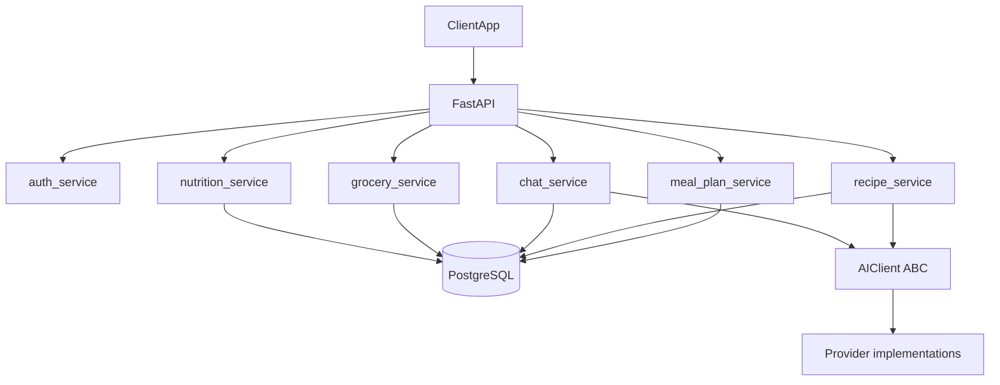

## FastAPI Meal Planner Backend (pluggable AI + Postgres)

### 1. High-level architecture

- **Goal**: A backend API that lets a client (Angular/web/mobile) manage a weekly meal plan (7 meals), call an **AI provider** to generate recipes, support per-meal chat refinement, and then produce a grocery list and approximate nutrition for each recipe.
- **Core pieces**:
  - `FastAPI` app exposing JSON endpoints.
  - `PostgreSQL` as the main database.
  - `SQLAlchemy` + `Alembic` for ORM and migrations.
  - An **abstract AI client interface** (Python ABC) with concrete implementations for each supported provider, plus a **test/local double** that does not perform network calls.
  - Service layer modules for meal planning, recipe generation, grocery list building, and nutrition estimation (they depend on the ABC, not a specific vendor SDK).

### 2. Project & module structure

- **Top-level layout** (example):
  - `app/main.py` – FastAPI app, routers include, startup/shutdown.
  - `app/config.py` – settings (DB URL, **AI provider id**, credentials and model name per provider as needed).
  - `app/db/session.py` – SQLAlchemy engine, sessionmaker, dependency.
  - `app/db/base.py` – Base class and model imports.
  - `app/models/` – SQLAlchemy models (`user.py`, `meal_plan.py`, `recipe.py`, `ingredient.py`, `chat.py`).
  - `app/schemas/` – Pydantic models for requests/responses.
  - `app/routers/` – FastAPI routers (`meals.py`, `recipes.py`, `chat.py`, `grocery.py`, `auth.py`).
  - `app/services/` – business logic (`meal_plan_service.py`, `recipe_service.py`, `grocery_service.py`, `nutrition_service.py`).
  - `app/clients/` – AI integration:
    - `base.py` (or `protocol.py`) – **ABC** defining the contract (e.g. `generate_recipes`, `chat_modify`) and shared types.
    - One module per provider (e.g. `anthropic_client.py`, future `openai_client.py`, etc.).
    - `test_client.py` (or similar) – **noop/recording implementation** for local runs: captures prompt text and parameters so you can review prompt parameterization without contacting a real model; returns deterministic or fixture-driven payloads for tests.
  - `app/utils/` – shared helpers (e.g., prompt templates, parsing utilities).
  - `alembic/` – migration environment and versions.

- **Wiring**: App startup (or a factory) selects the concrete client from `settings` (e.g. `AI_PROVIDER=anthropic` vs `AI_PROVIDER=test`) and injects it into services; tests swap in the test double by default.

### 3. Data model design (Postgres via SQLAlchemy)

- **Users** (`User`)
  - Fields: `id`, `email`, `password_hash`, timestamps.
  - For now, simple email+password; later can plug in OAuth/identity provider.

- **Meal planning & recipes**
  - `MealPlanWeek` – a weekly plan per user.
    - Fields: `id`, `user_id`, `start_date`, `end_date`, `title`, timestamps.
  - `PlannedMeal` – one of the 7 meals in the week.
    - Fields: `id`, `meal_plan_week_id`, `day_index` (0–6), `meal_name` (e.g., "Chicken Tacos"), `status` (draft/final), timestamps.
  - `Recipe` – a recipe owned by a `User`, reusable across multiple meal plans.
    - Fields: `id`, `user_id`, `title`, `instructions` (text/JSON blocks), `servings`, `source_model`, timestamps.
  - `PlannedMealRecipe` – join table linking a `PlannedMeal` to one or more `Recipe` rows.
    - Fields: `id`, `planned_meal_id`, `recipe_id`, `role` (e.g. entree/side).
    - A `PlannedMeal` can have multiple recipes; a `Recipe` can appear in multiple planned meals.

- **Ingredients & grocery items**
  - `RecipeIngredient`
    - Fields: `id`, `recipe_id`, `name`, `quantity`, `unit`, optional `category` (produce/dairy/etc.).
  - `GroceryList` – per-week grocery aggregation.
    - Fields: `id`, `meal_plan_week_id`, `title`, `notes`, timestamps.
  - `GroceryItem`
    - Fields: `id`, `grocery_list_id`, `name`, `total_quantity`, `unit`, `category`, `checked`.

- **Chat & AI interactions**
  - `ChatSession`
    - Fields: `id`, `recipe_id` (or `planned_meal_id`), `user_id`, `title`, timestamps.
  - `ChatMessage`
    - Fields: `id`, `chat_session_id`, `role` (user/assistant/system), `content`, `created_at`.

- **Nutrition estimates**
  - `NutritionInfo`
    - Fields: `id`, `recipe_id`, macro breakdown (`calories`, `protein_g`, `carbs_g`, `fat_g`, etc.), `per_serving` flag.

### 4. API endpoint design

- **Auth endpoints** (`/auth` router)
  - `POST /auth/register` – create user (basic email/password for now).
  - `POST /auth/login` – return JWT (or similar) for authenticated requests.

- **Meal plan & recipe endpoints** (`/meal-plans`, `/recipes` routers)
  - `POST /meal-plans` – create a new weekly meal plan (optionally send the 7 meal names).
  - `GET /meal-plans` – list user’s meal plans.
  - `GET /meal-plans/{plan_id}` – get one plan with its 7 `PlannedMeal` entries.
  - `PUT /meal-plans/{plan_id}` – update plan metadata or meal names.
  - `POST /meal-plans/{plan_id}/generate-recipes` – call the configured **AI provider** to generate a recipe for each planned meal (7 calls or a batched call); store `Recipe` + `RecipeIngredient` rows.
  - `GET /meals/{meal_id}/recipe` – get the generated recipe + nutrition, if available.

- **Chat endpoints** (`/chat` router)
  - `POST /recipes/{recipe_id}/chat-sessions` – create a new chat session for refining a recipe.
  - `GET /chat-sessions/{session_id}` – retrieve chat history.
  - `POST /chat-sessions/{session_id}/messages` – send a user message with a requested modification; call the **AI provider**, save assistant message, and (optionally) update the underlying `Recipe`/`RecipeIngredient`.

- **Grocery list endpoints** (`/grocery` router)
  - `POST /meal-plans/{plan_id}/grocery-list` – generate grocery list from all `RecipeIngredient` rows (aggregate by name+unit, categorize, store `GroceryList` + `GroceryItem`).
  - `GET /grocery-lists/{list_id}` – get the grocery list.
  - `PATCH /grocery-items/{item_id}` – toggle `checked` or adjust quantities.

- **Nutrition endpoints** (`/nutrition` router) – or folded into recipe endpoints
  - `POST /recipes/{recipe_id}/nutrition` – calculate or refresh nutrition info for a recipe (via AI and/or external API).
  - `GET /recipes/{recipe_id}/nutrition` – fetch stored `NutritionInfo`.

### 5. AI provider integration & prompt strategy

- **Abstract interface** (`app/clients/base.py` or equivalent)
  - Define methods the app actually needs (e.g. structured recipe generation, chat with optional recipe JSON revision) as abstract methods on an ABC (or a `Protocol` if you prefer structural typing).
  - Keep vendor-specific SDK details inside each concrete class; services only see the ABC.

- **Concrete providers** (e.g. `app/clients/anthropic_client.py`, future modules for other APIs)
  - Each implementation handles that vendor’s authentication, endpoints, and response shapes, then maps results into the same in-app DTOs the services already use.

- **Local / test double** (`app/clients/test_client.py` or similar)
  - Implements the same ABC without outbound HTTP: records prompts, template parameters, and message history for inspection; returns canned or configurable JSON so downstream parsing and DB writes can still be exercised locally.
  - Use in pytest and for manual runs when validating prompt parameterization only.

- **Prompt templates** (`app/utils/prompt_templates.py`)
  - **Recipe generation prompt**: instruct the model to output structured JSON for each meal:
    - title, servings, ingredients (name, quantity, unit, category), steps, and basic nutrition estimates.
  - **Chat modification prompt**: include current recipe JSON + chat history, ask the model to:
    - answer conversationally, and
    - optionally return a new revised recipe JSON when structural changes are requested (e.g., "make this vegetarian").
  - Templates remain **vendor-agnostic** string builders; providers only differ in how they send the assembled text.

- **Parsing & validation**
  - Deserialize the model’s structured output into Pydantic schemas (e.g., `RecipeCreate`, `RecipeIngredientCreate`, `NutritionInfoCreate`).
  - Validate before persisting to Postgres; handle errors gracefully (e.g., fallback to partial results or ask the client to re-try).

### 6. Grocery list & nutrition logic

- **Grocery list generation** (`app/services/grocery_service.py`)
  - Query all `RecipeIngredient` records for a given `MealPlanWeek`.
  - Normalize ingredient names (e.g., case, pluralization basic rules) and units where possible.
  - Aggregate quantities by `(name, unit)` and classify into categories (e.g., by a small static mapping table or AI-assisted classification).
  - Persist `GroceryList` + `GroceryItem` records.

- **Nutrition estimation** (`app/services/nutrition_service.py`)
  - **Phase 1**: Ask the configured **AI provider** to approximate per-serving macro nutrients from the recipe ingredient list and steps; parse into `NutritionInfo`.
  - **Phase 2 (optional)**: Integrate with a dedicated nutrition API (e.g., USDA, Edamam) for more precise data and store results in the same `NutritionInfo` model.

### 7. Auth, security, and multi-user concerns

- Implement simple JWT-based auth for now (e.g., `Authorization: Bearer <token>`):
  - `User` table with hashed passwords (e.g., `passlib`).
  - Dependency to resolve `current_user` from the token.
  - All meal/recipe/chat/grocery endpoints require `current_user` and filter data by `user_id`.
- Ensure **AI provider credentials**, DB URL, and JWT secrets are taken from environment variables and not hard-coded.

### 8. Testing & observability

- **Testing**
  - Use `pytest` + `httpx` test client for FastAPI endpoints.
  - **Inject the test AI client** (ABC implementation) in tests so no real provider API calls occur; assert on recorded prompts and structured return payloads as needed.
  - Include tests for:
    - recipe generation service (with fake AI response),
    - grocery aggregation logic,
    - nutrition parsing and storage,
    - auth-protected endpoints.

- **Logging & monitoring**
  - Configure structured logging (request IDs, user IDs where applicable).
  - Log **AI request metadata** (provider id, model name, token usage if available)—not full prompt/response content—for debugging.

### 9. Deployment considerations

- **Containerization**
  - Dockerfile with a production server (e.g., Uvicorn + Gunicorn) and environment-based config.
- **Database**
  - Use Postgres locally (Docker or local install) and run `alembic` migrations on deploy.
- **Frontend-agnostic API**
  - Keep responses clean and JSON-based, suitable for an Angular SPA, React, or mobile app.

This plan focuses solely on the **FastAPI + Postgres backend**, leaving the frontend flexible so you can later plug in Angular or another client. AI capabilities are **provider-agnostic at the service layer**, with new vendors added by subclassing the ABC rather than rewriting business logic.
